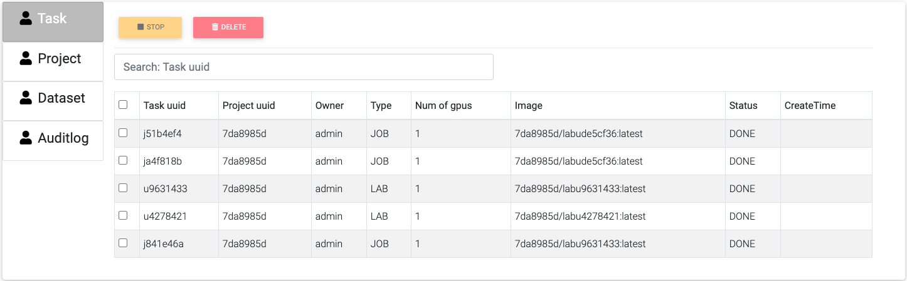

.. _admin:

**************
Administration
**************

To enter administration settings click the bottom-left corner button.

Default login
=============

The default administration credentials are **admin/admin**.

Profile
=======

It shows current user profile and change password operation.

Account
=======

User
----

In user managment tab

Allows create, edit and delete user.

Create
++++++

Click "Users" button.

Click "Create" button.

Fill username and password.

Select single role from drop down list.

Gpu limit is how many gpus can this user occupy, "-1" means no restriction.

Manage group if user needs.

Edit
++++

Select user that needs to be edited, click "Edit" button.

Fill new info.

Delete
++++++

Select user that needs to be deleted, click "Delete" button. Confirm.

Group
-----

Is group managment tab

Allows new and delete group.

Create
++++++

Click "Create" button.

Fill group name and confirm.

Delete
++++++

Select group that needs to be deleted, click "Delete" button. Confirm.

Dashboard
=========

Task
----

Shows a list of currently running instances of labs and jobs.

Stop
++++

Select the instance that needs to be stopped, and then click "Stop".

Only running status can be stopped.

Delete
++++++

Select the instance to be deleted, and click "Delete" to delete the task.

Only not running status can be deleted.

Project
-------

Project management tab. Shows list of projects.

Create
++++++

Click create button.

Fill project name and annotation, click "Create".

Members
+++++++

To edit project members click "Members" button next to the project name.

To add user to the project click "Add member", then type their name, select permissions and click "Save", then click "Done".

To delete user from project click "Delete" next to the username, then click "Done".

Delete
++++++

Select needed project and click "Delete" button. Confirm.

Auditlog
--------

Log of system events in chronological order. Use "Search" box on top to look for specific events.

.. image:: ../_static/admin/auditlog.png

Device
======

Shows All hosts' hardwave informations.

Setting
=======

Host
----

Shows list of hosts in the system.

Create
++++++

First on the target host create a sudo user account.

Give it the password-less privilege for mount related commands. For this create fallowing file `/etc/sudoers.d/<account>` with content

.. code-block:: console

  <account> ALL=(ALL) NOPASSWD: /usr/bin/mount,/usr/bin/umount,/bin/sh

Then generate the pair of ssh-keys (select all defaults). For this on host machine console type:

.. code-block:: console

  ssh-keygen -t rsa -b 4096 -C "<your_string>"
  eval "$(ssh-agent -s)"
  ssh-add ~/.ssh/id_rsa
  cat ~/.ssh/id_rsa.pub > ~/.ssh/authorized_keys

On MLSteam webportal Host page click "Create". 

Then fill the form with ip address, account name and for "SSH KEY" field copy the content of `~/.ssh/id_rsa`.

Delete
++++++

Select needed host and click "Delete" button. Confirm.

Certificate
-----------

Shows list of certificates in the system.

Create
++++++

Click create button.

Input certificate name and doamin name, click "Test anc Create". (Optional, email) 

Delete
++++++

Select needed host and click "Delete" button. Confirm.

Repository
++++++++++

License
+++++++

Shows current license file.

If license needs to be updated click "Edit" to input new license file.

Input license text in the field and click "Save".

