.. _classification:

Classification
==============

This part will show how to train image classification model from template.

Quick start
-----------

On the top bar click "Project" to create your own project.

.. image:: ../_static/project/create_project.png

Change to template tab. Then click "Use Template" on the classification card. This will create a new lab with Mnist dataset already attached to it.

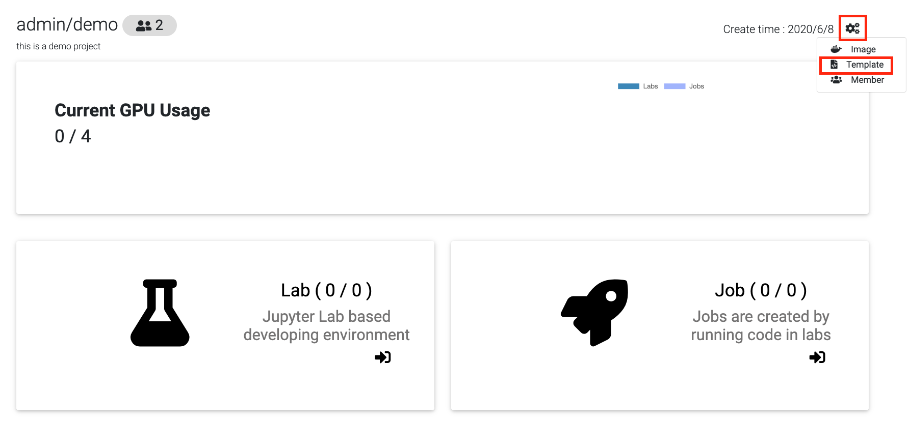

In the lab page, click "Commit job". This will start training job from the template code and redirect to the jobs list page.

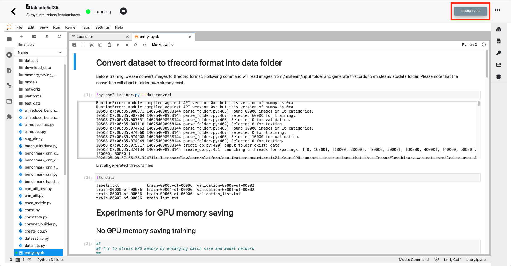

Click on the job id or screen icon to view training progress.

.. image:: ../_static/template/view_job1.png

Job page displays 

* Loss value graph
* Log output
* Configuration file (mlsteam.yml)
* Used docker image name, gpus, status, status button (top panel)

.. image:: ../_static/template/view_job2.png

Use your own dataset
--------------------

First create lab from classification template and enter attached lab (covered in Quick start).

Default Mnist dataset is read only.

Create an empty dataset and attach it to the lab. In this example it will be called "test1".

For this go to Dataset page and click "New Dataset". Then enter dataset name and click create.

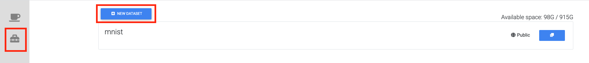

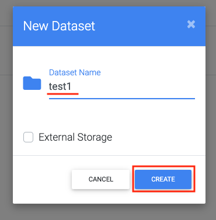

Go back to lab. For this click "Project" -> "Lab".

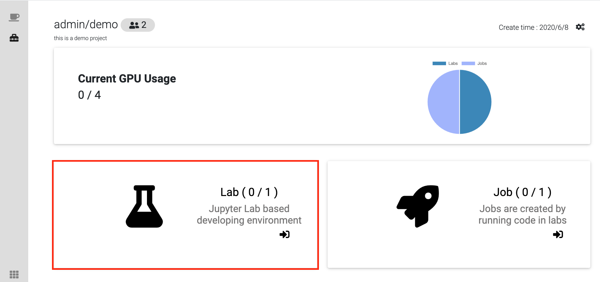

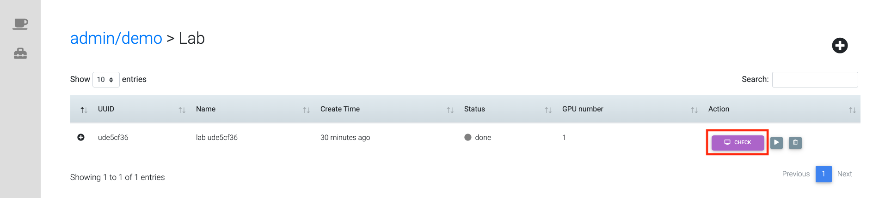

Click start botton to start the project.

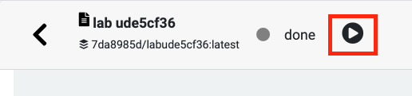

To attach dataset to lab enter it's name and click "Attach dataset".

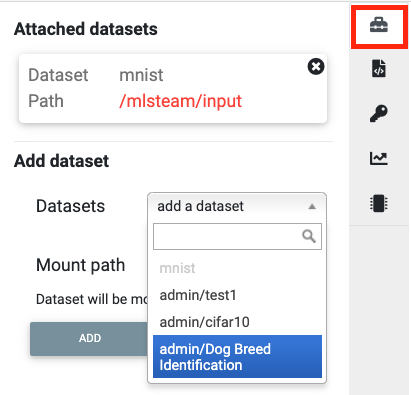

Download dataset (use cifar10 as example)
+++++++++++++++++++++++++++++++++++++++++++++++++++

If you have your own dataset, skip to next step.

Provided script can download and convert to the right folder format standard datasets such as **mnist, iris, cifar10, cifar100**.
This example shows how to download and store cifar10 into our "test1" dataset.

First, scroll down to "Other" block in lab window, click on "Terminal" button:

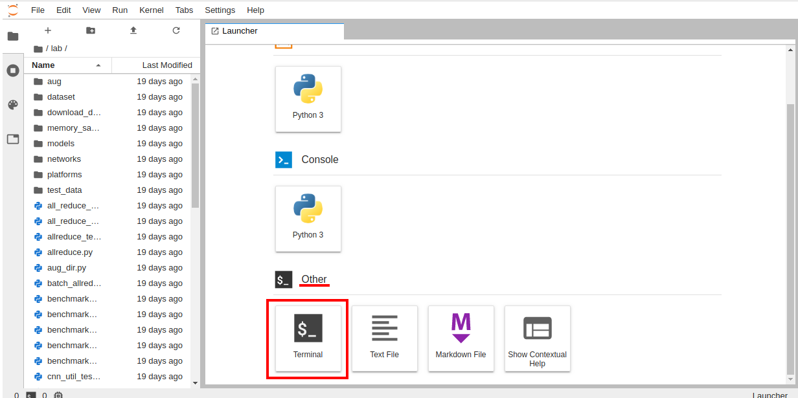

Enter terminal. Type in console

.. code-block:: console

    python2 download_data cifar10 /mlsteam/input/<test1>

.. note::
    replace "test1" for your own dataset name.

Folder format
^^^^^^^^^^^^^

If non-standard dataset is needed, convert it to the next folder format yourself.
Create *train* and *test* folders each with subdirectories of classes. 

.. code-block:: console

    train
    |----- class1
           |----- trimage1
                  trimage2
                  trimage3
                  ...
           class2
           ...
    test
    |----- class1
           |----- valimage1
                  valimage2
                  valimage3
                  ...
           class2
           ...

Preprocess dataset
++++++++++++++++++

Parse folder
^^^^^^^^^^^^
To generate labels.txt and file list of dataset, run

.. code-block:: console

  python2 parse_folder.py -t /mlsteam/input/<test1>/train_list.txt /mlsteam/input/<test1>/train /mlsteam/input/<test1>/labels.txt
  python2 parse_folder.py -v /mlsteam/input/<test1>/validation_list.txt /mlsteam/input/<test1>/test /mlsteam/input/<test1>/labels.txt

Generate tfrecord
^^^^^^^^^^^^^^^^^

To generate tfrecord from dataset, run

.. code-block:: console

  python2 create_db.py --labels_file ../input/<test1>/labels.txt --prefix=train ../input/<test1>/train_list.txt ../input/<test1>/
  python2 create_db.py --labels_file ../input/<test1>/labels.txt --prefix=validation ../input/<test1>/validation_list.txt ../input/<test1>/

Modify configuration file
^^^^^^^^^^^^^^^^^^^^^^^^^

Open mlsteam.yml and modify input directory in "command" field.

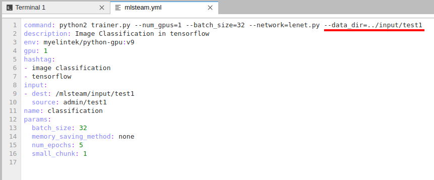

Parameters (optional)
+++++++++++++++++++++

For classification template, following parameters are supported followed by trainer.py:

* num_epoch 
* batch_size
* piecewise_learning_rate_schedule 
* memory_saving_method - whether to apply or not GPU memory optimization
* small_chunk - forward accumulation times on each GPU
* network - network .py file to use
* data_dir - input directory (dataset)
* train_dir - output directory (checkpoints)

piecewise_learning_rate_schedule
^^^^^^^^^^^^^^^^^^^^^^^^^^^^^^^^

Specifies a piecewise learning rate schedule based on the number of epochs. This is the form LR0;E1;LR1;...;En;LRn, 
where each LRi is a learning rate and each Ei is an epoch indexed from 0. The learning rate is LRi if the 
E(i-1) <= current_epoch < Ei.

For example, if this paramater is 0.3;10;0.2;25;0.1, the learning rate is 0.3 
for the first 10 epochs, then is 0.2 for the next 15 epochs, then is 0.1 until training ends

memory_saving_method
^^^^^^^^^^^^^^^^^^^^

* *none* - do not apply any memory saving mechanism.
* *recomputing* - update graph to minimize GPU memory utilization.

small_chunk
^^^^^^^^^^^

Small chunk number means number of forward accumulation times on each GPU before doing backforward propogation. This can speed up GPU computing in multiple GPU setup when no nv-link is presented.

network
^^^^^^^

Name of network file. All avaliable networks are located in `lab/networks` directory.
User can modify existing networks or create it from scratch using template.py

data_dir
^^^^^^^^

Directory that contains tfrecords.

train_dir
^^^^^^^^^

Directory to write checkpoints. Create empty directory in attached dataset (in this example empty directory name is `checkpoints`) and specify it as  train_dir.

Ex: `--train_dir=/mlsteam/input/test1/checkpoints`

Example
^^^^^^^

.. code-block:: console

  command: python2 trainer.py --num_gpus=1 --batch_size=32 --network=resnet32.py --data_dir=../input/test1 --train_dir=/mlsteam/input/test1/checkpoints
  description: Image Classification in tensorflow
  env: myelintek/python-gpu:v9
  gpu: 1
  hashtag:
  - image classification
  - tensorflow
  input:
  - dest: /mlsteam/input/test1
    source: admin/test1
  name: classification
  params:
    batch_size: 32
    piecewise_learning_rate_schedule: "0.1;3;0.01;8;0.001" 
    memory_saving_method: none
    num_epochs: 10
    small_chunk: 1

How to use TensorBoard
----------------------

TensorBoard provides the visualization and tooling needed for machine learning experimentation:

* Tracking and visualizing metrics such as loss and accuracy
* Visualizing the model graph (ops and layers)
* Viewing histograms of weights, biases, or other tensors as they change over time
* Projecting embeddings to a lower dimensional space
* Displaying images, text, and audio data
* Profiling TensorFlow programs
* And much more

.. tip::
   TensorBoard working with TensorFlow-based code.

.. image:: ../_static/template/template_tensorflow.png

Starting TensorBoard
^^^^^^^^^^^^^^^^^^^^

Summit a job in the first, and wait for the job finished.

Then specify the file path of training result in logdir and click start. (The default directory is /mlsteam/output)

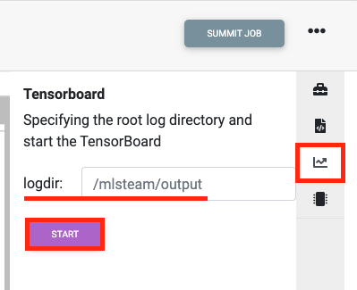

Click the url for starting TensorBoard.

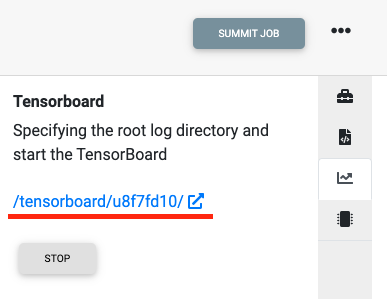

For more details, please see the link https://www.tensorflow.org/tensorboard/get_started.