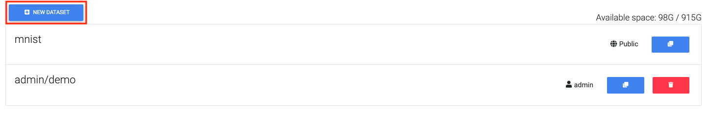
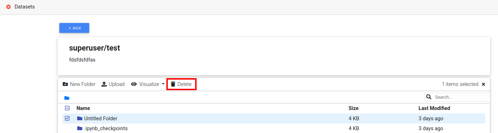

########
Dataset
########

Dataset is any collection of data. here we listed all available operations below in each section.

* :ref:`create_dataset`
* :ref:`create_dataset_from_nfs`
* :ref:`manipulate_dataset`
* :ref:`visualize_dataset`
* :ref:`delete_dataset`

.. _create_dataset:

Create dataset
==============

To create an empty dataset, click new dataset button and specify dataset name.

  click new dataset button on the dataset page

  named 'demo' for this dataset

.. tip::

  All created datasets are private and within in your account's namespace.

.. _create_dataset_from_nfs:

Create dataset from NFS volume
==============================

You can create a dataset which mounts a remote NFS volume and manage the data in the system.

Simply click new dataset button, specify the dataset name and check *External Storage* checkbox. From drop down menu select NFS.
Input the NFS server ip and mount point path. click *Create*.

  create a dataset which mounts remote NFS volume

.. _manipulate_dataset:

Manipulate dataset
==================

Below shows all available operation can do in the dataset page.

Browse dataset
--------------

To browse the dataset, click on dataset name.

Clone dataset
-------------

To clone a dataset, click *Clone* button to create a copy of dataset.

Upload files to dataset
-----------------------

To upload files to a dataset, simply drag and drop files from local PC or click *Upload* button to select local files.

Extract files from archive
---------------------------

Upload too many files will cause the web browser freeze. Therefore, you can compress files into one archive file and uncompress the file on the dataset page.

  select archive file and click "Extract".

.. tip::

  Supported compress file format *tar, tgz, tar.gz, zip.*

New folder
-----------

To create folders in dataset, click *new folder* button within a dataset.

  click *new folder*

  input folder name and click create.

Download files
--------------

To download files, select a file and click *download* button.

.. figure:: ../_static/dataset/download_dataset.png

  download a file

Delete folder/file
------------------

To delete files or folders, select a folder or a file and click *delete*.

  delete a file in dataset page

.. _visualize_dataset:

Visualize labeled dataset
=========================

For supervised learning, dataset has to be labeled with correct answers. For better visualization, system support following labeling format for visualization.

* :ref:`yolo`

.. _yolo:

YOLO format
-----------

To visualize YOLO dataset, we have to select the folder which contains images and specify it's *yolo* format in dataset page.

  select *images* folder and selct yolo in *Visualize* dropdown list.

To visualize YOLO dataset, we need following annotation files and inputs:

* class_file: specify each index name of labels.
* label_path: contains YOLO format label files.
* predict_path: (optional) contains model prediction results in YOLO format.

  example of specifying a YOLO format image folder

If success, *yolo* tag will appear in related files and folder.

click images to visualize bounding box in each labeld image.

  visualize bouding box in a yolo image

If you want remove the *yolo* tag, click 'x' on top of the dataset page.

  remove yolo tag images

.. _delete_dataset:

Delete dataset
==============

To delete a dataset, click trash icon in the dataset page.

  delete a dataset.