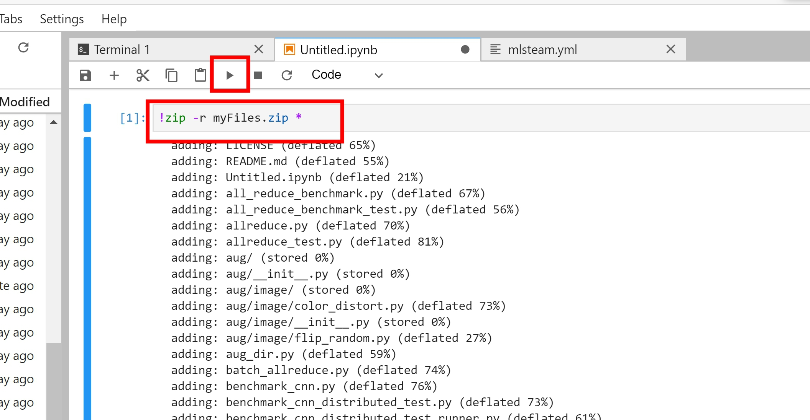
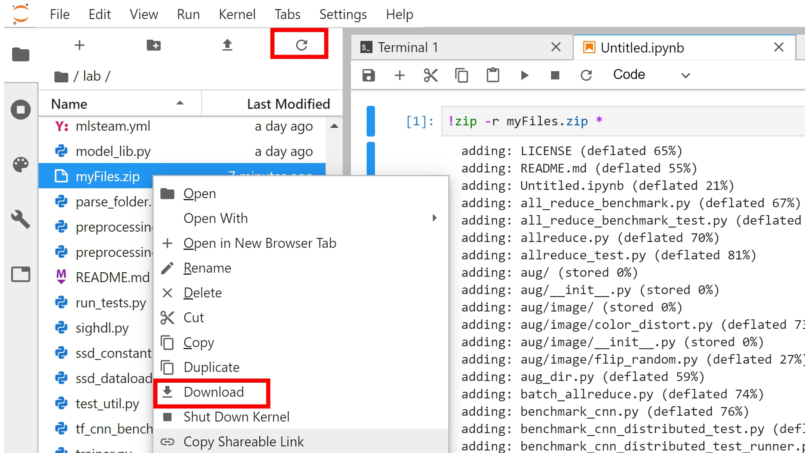

How to download multiple files from a lab?
==========================================

In a lab page, users can download individual files by right clicking the selected files and click download option.
However, some browsers will block downloading multiple files. An easy way to work around is to zip all files into a single file and download it.

1. Use jupyterlab to zip all files
----------------------------------
First open a jupyterlab and past following command to zip all files:

.. code-block:: bash

   !zip -r myFiles.zip *

2. Download zipped file from jupyterlab
---------------------------------------
Press refresh button and right click the zip file to download.

