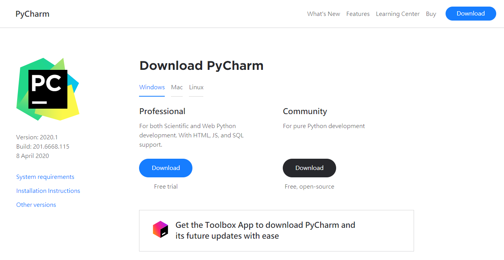
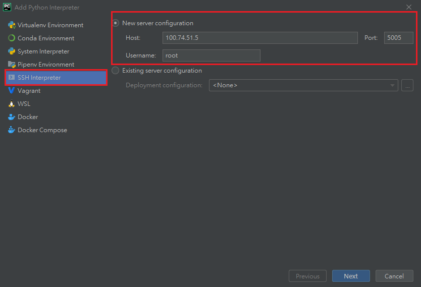

########
PyCharm
########

The following tutorial is based on Windows 10, 2019.3.3 (Professional Edition)

.. caution::

  Please note that remote connection feature only supported at PyCharm Professional!

Install PyCharm
================

Download PyCharm according to your operating system from `jetbrains.com/pycharm <https://www.jetbrains.com/pycharm/download/>`__

SSH key
=========

Open your lab and make sure the ssh key is generated. Click the ssh key to download to your PC.

  SSH Config, download SSH key by clicking the ssh key link

.. tip::

  downloading will start automatically, if it does not press the ssh key link.

.. note:: 

  In Linux, you need to change the sshkey file to 600 mode.

PyCharm Project
===============

Open the PyCharm and create a new project.

Create a new *SSH Interpreter* from **Pure Python** -> **Existing interpreter** -> **...**

Setup Remote Interpreter
------------------------

Type in the SSH host IP, port and user information in **SSH Interpreter** section. (Fill in the information based on *SSH Config* above)

Click *Next* and PyCharm will try to connect to the Lab, click *Yes* to continue.

PyCharm will ask you for authentication, select the downloaded SSH Key at **Key pair** -> **Private key file**.

Once PyCharm successfully connect to the lab, you can set the interpreter path */usr/bin/python3*. Then, click *Finish* to complete the interpreter setup.

Now the remote interpreter is added, click the *Create* button to open the project page.

.. tip::

  You can select the *remote project location* at this page or later.

Project Files Synchronize
==========================

In PyCharm, all the file editions happen in you PC. We have to download lab files to your PC first. Click **Tools** -> **Deployment** -> **Configuration** to select remote folder.

Select remote folder by clicking *remote host* -> *Mappings* -> *Deployment path*.

Choose the remote path **/mlsteam/lab** and click *OK*.

Now we can download the remote */mlsteam/lab* folder to your PC.

First, select your project folder, in this case is **untitled** at left column of PyCharm. Then, click **Tools** -> **Deployment** -> **Download from** -> remote host.

The download should proceed and you will see the following messages if the lab has many files.

You can browse and edit the loaded files in left column of PyCharm. Any modification in the files will be synchronized to remote folder automatically.

.. note::

  If you want to synchronize(upload) local PC files to remote manually by clicking **Tools** -> **Deployment** -> **Sync with Deployed to ...**
