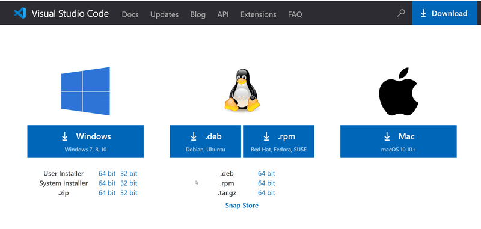
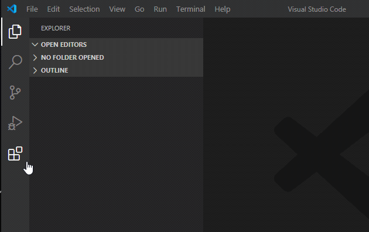
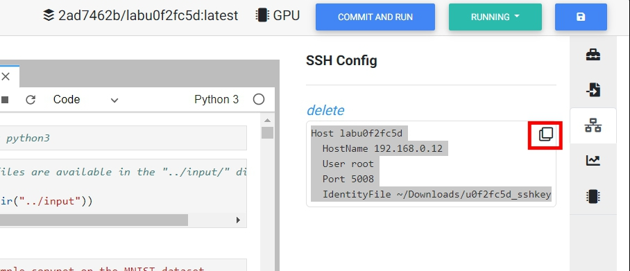
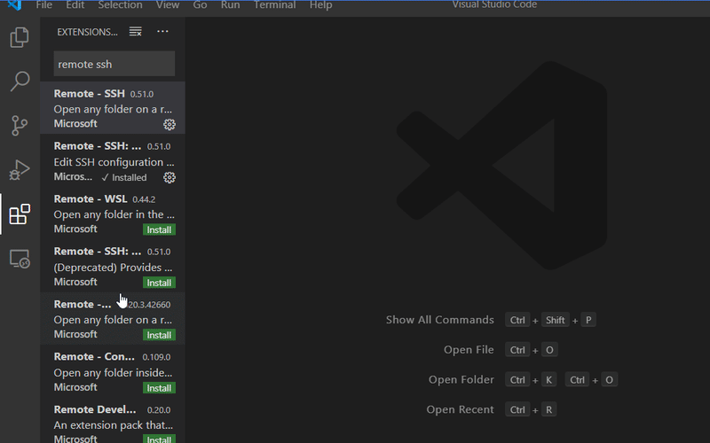
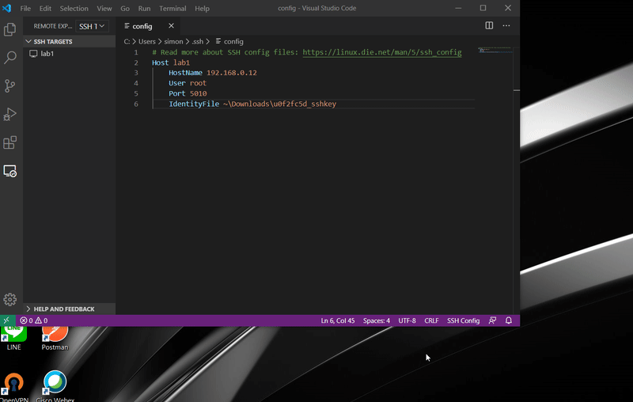
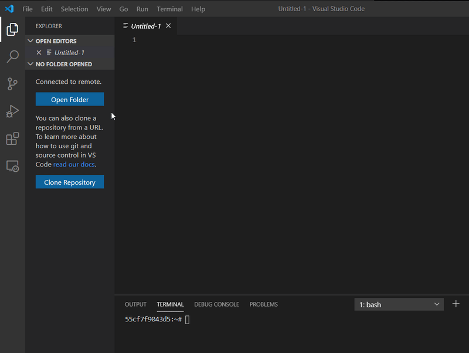
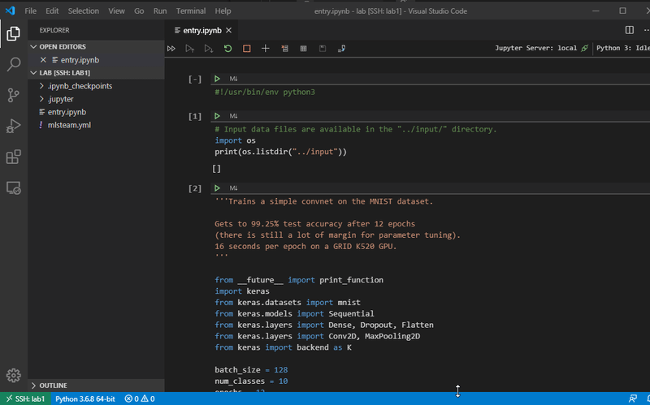

#######
VSCode
#######

Step by step tutorial to setup VSCode for connecting to a lab

Install VSCode
-----------------

Download VSCode according to your operating system from `code.visualstudio.com <https://code.visualstudio.com/Download>`__

  downloaded and install VSCode.

Install extenstions in VSCode
--------------------------------

Open VSCode, search and install extension of *remote SSH*

  install *remote ssh* extension

SSH key and SSH config
-----------------------

Open a lab you want to access. Make sure the lab is in running state, click SSH tab at right navbar and generate SSH conifg.

You will see the following content and click the ssh key to download to your PC.

.. figure:: ../_static/remote_ide/sshkey.png
  :width: 600

  download SSH key

.. note::
  
  In Linux, you need to change the sshkey file to 600 mode.

  *ex. chmod 600 u0f2fc5d_sshkey*

Copy the ssh config by clicking copy icon at top-right of the config

  copy SSH config

.. note:: Windows10 accepts both / and \ as path separator

Paste ssh config in VSCode
-----------------------------

Open remote explorer in VSCode. Click configure in ssh targets. 

Paste the copied ssh config to ssh config in VSCode. Save the config file and the new created host will shown on the *SSH TARGETS* section.

Connect to remote lab
-------------------------

Click created ssh target to connect to remote lab

.. note:: if there is an error while connecting, try to remove *know_hosts* file in .ssh folder

Open remote folder
---------------------

Congradulation! You have successfully connected to a lab. You can open a remote folder in the *Explorer* at left side of VSCode.

Console in VSCode
-----------------

You can also open a console in VSCode by dragging up from buttom of the window. 

Visit VSCode website to find out more extensions!

https://code.visualstudio.com/docs/editor/extension-gallery

