.. _image:

****************
Image Management
****************

Install Docker Desktop
=======================

Docker Desktop for Windows is Docker designed to run on Windows 10.

System Requirements
-------------------

- Windows 10 64-bit: Pro, Enterprise, or Education (Build 15063 or later).
- Hyper-V and Containers Windows features must be enabled.
- The following hardware prerequisites are required to successfully run Client Hyper-V on Windows 10:
    - 64 bit processor with Second Level Address Translation (SLAT) 4GB system RAM
    - BIOS-level hardware virtualization support must be enabled in the BIOS settings. For more information, see Virtualization.

You can get Docker Desktop on Windows from following link.

https://hub.docker.com/editions/community/docker-ce-desktop-windows/

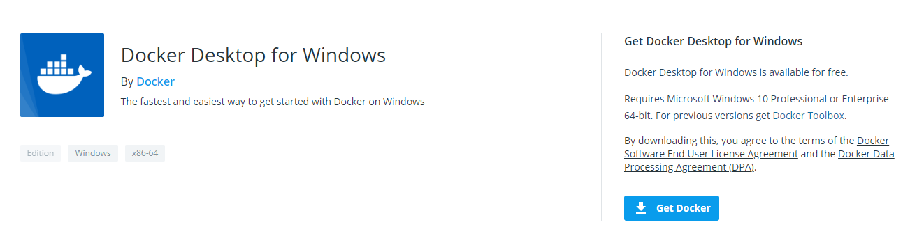

Legacy desktop solution. Docker Toolbox is for older Mac and Windows systems that do not meet the requirements of Docker Desktop for Mac and Docker Desktop for Windows. We recommend updating to the newer applications, if possible.

You can get Docker Toolbox on Windows from following link:

https://docs.docker.com/toolbox/toolbox_install_windows/

Double-click Docker for Windows Installer to run the installer.

When the installation finishes, Docker starts automatically. The whale in the notification area indicates that Docker is running, and accessible from a terminal.

List Image
===========

Click the **Image** botton in a project, the image list table shows all available container images.

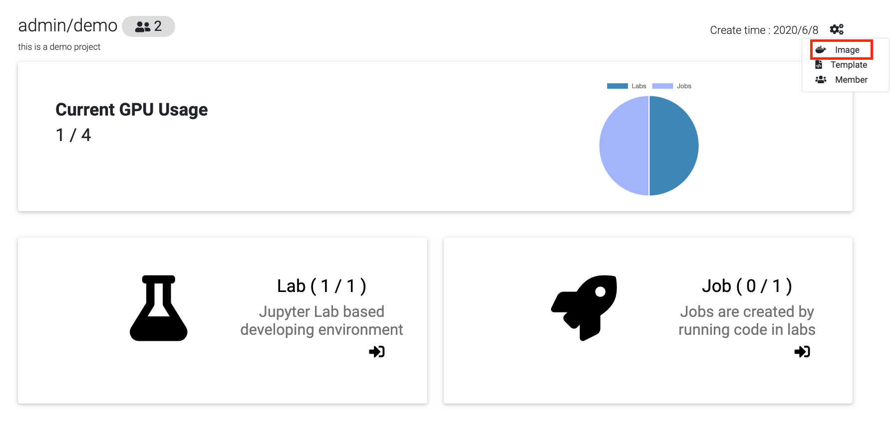

Delete Image
============

Click the trash icon of the image you want to delete.

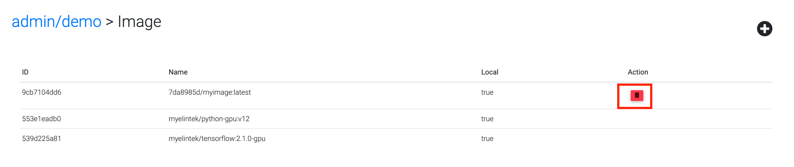

Save Image
==========

In the lab page, you can save the lab environment as an image.
Click "Save as" button in a running lab and type-in image name to store the image.

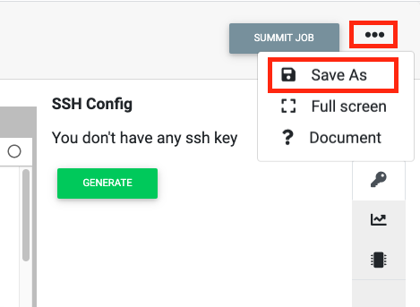

  click save as image button

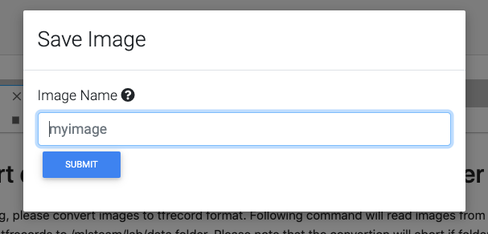

  type-in image name

.. note:: 
    Image name must be valid ASCII, lowercase, uppercase letters, digits, underscores, periods and dashes.

Enable docker build config
==========================

Login as administrator.
Click "Setting".

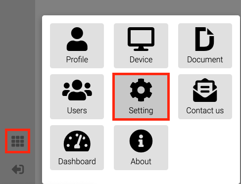

Click "Config".
Edit docker_build value as True.

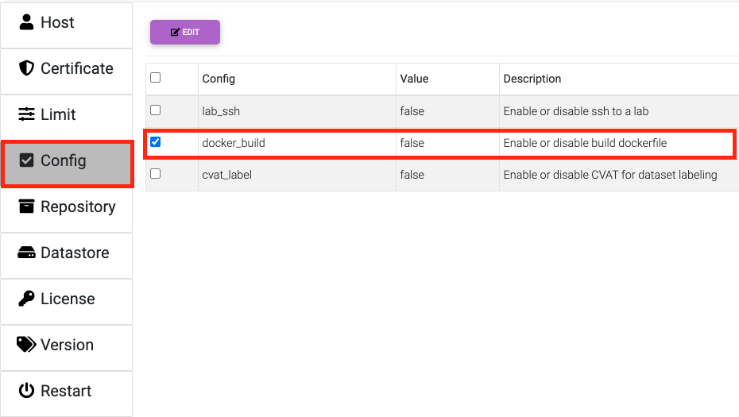

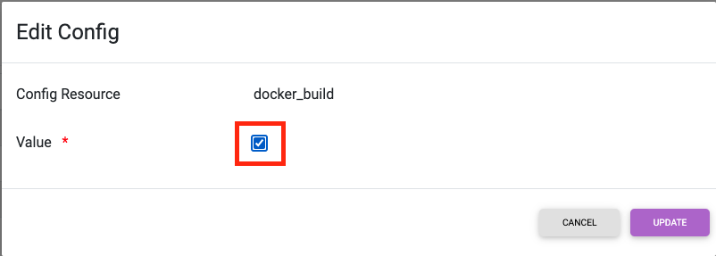

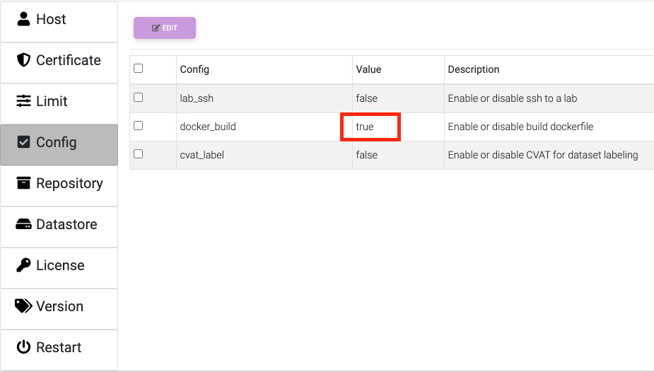

Create a DockerFile
===================

In this step, you write a Dockerfile that builds a Docker image.

For example, create a file named Dockerfile and paste the following:

.. code-block:: bash

  FROM nvidia/cuda:10.2-cudnn7-runtime-ubuntu18.04
  RUN pip install jupyterlab
  RUN rm -rf /usr/lib/x86_64-linux-gnu/libcuda.so /usr/lib/x86_64-linux-gnu/libcuda.so.1 /tmp/*
  WORKDIR /mlsteam/lab
  CMD ["bash", "-c", "source /etc/bash.bashrc && jupyter notebook --notebook-dir=/tf --ip 0.0.0.0 --no-browser --allow-root"]

Build DockerFile
================

If you want to upload your own dockerfile and build it. Click the "New Image" button.

Type the image name and select dockerfile in your file system.

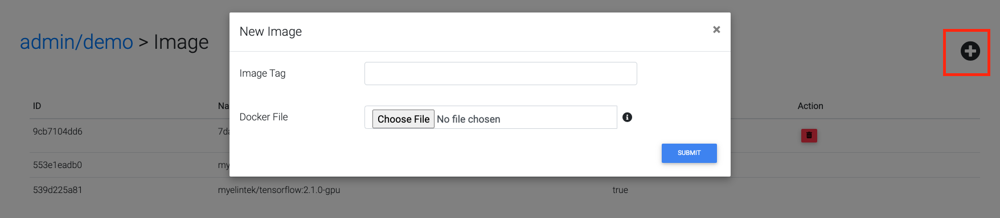

System will start building dockerfile once you click submit.

If the build success, the built image will be pushed to the repository server (optional).

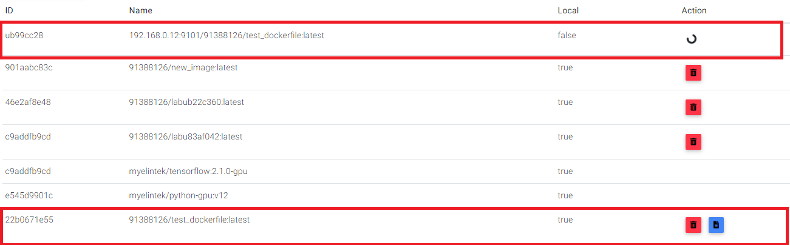

You can view the building log message by clicking the image file icon.

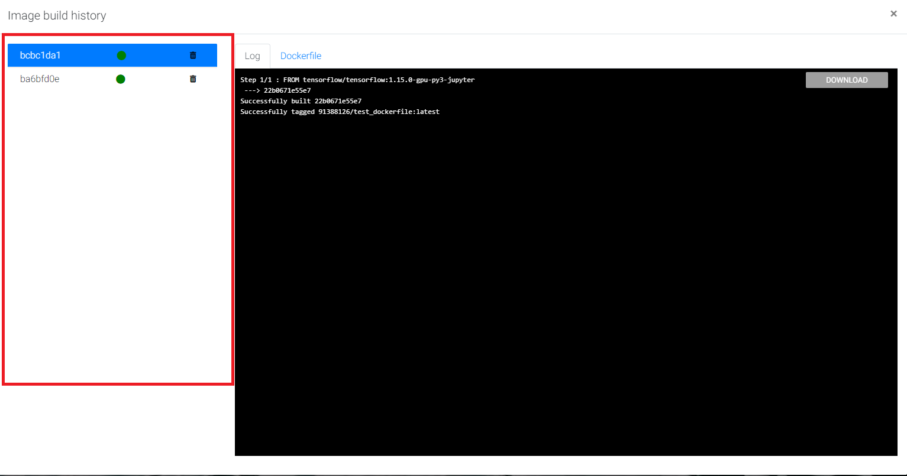

  dockerfile with same image name will be grouped

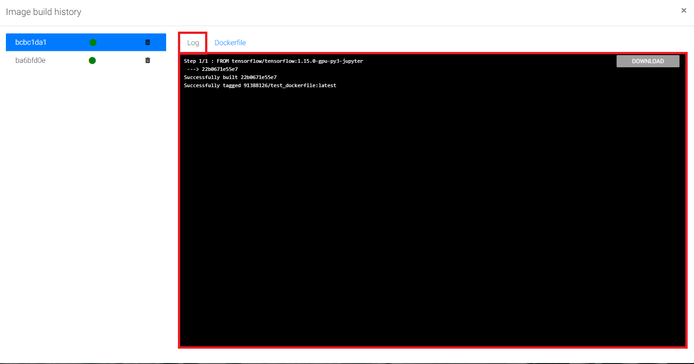

  build image log message

dockerfile example is shown below

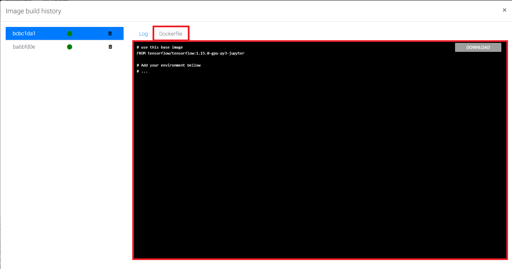

Push & Pull Image
==================

Following steps show how to manage project images from your PC

Add insecure registry
---------------------

Add the following contents in the ``daemon.json`` file, whose default location is ``/etc/docker/daemon.json`` on Linux or ``C:\ProgramData\docker\config\daemon.json`` on Windows Server. If you use Docker Desktop for Mac or Docker Desktop for Windows, click the Docker icon, choose Preferences, and choose +Daemon.

An example for Linux:

.. code-block:: bash

  vim /etc/docker/daemon.json

.. code-block:: bash

  {
      "insecure-registries" : ["<domain.sample.com>:<port>"]
      ,"runtimes": {
          "nvidia": {
              "path": "nvidia-container-runtime",
              "runtimeArgs": []
          }
      }
  }

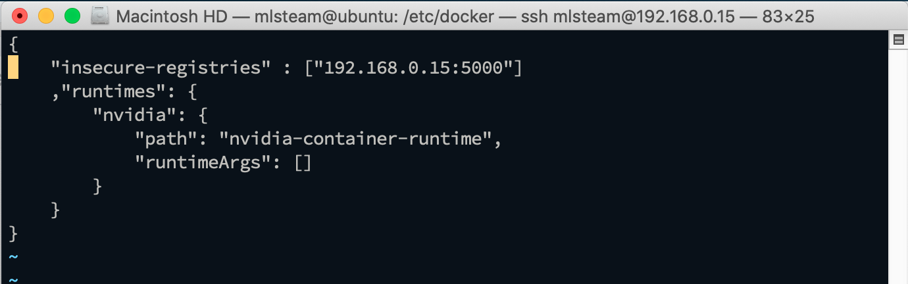

Substitute the address of your insecure registry for the one in the example.

.. note:: 
    You can find the registry address in Project -> Image page.

Remember to restart Docker for the changes to take effect.

.. code-block:: bash

  systemctl restart docker

Login registry
--------------

Turn on a terminal and login to registry.

.. code-block:: bash

    sudo echo "cT6Xi2Ajcgs32M96QswD" | docker login <domain.sample.com>:<port> -u admin --password-stdin

.. note::
    You can find out access_token in profile page.

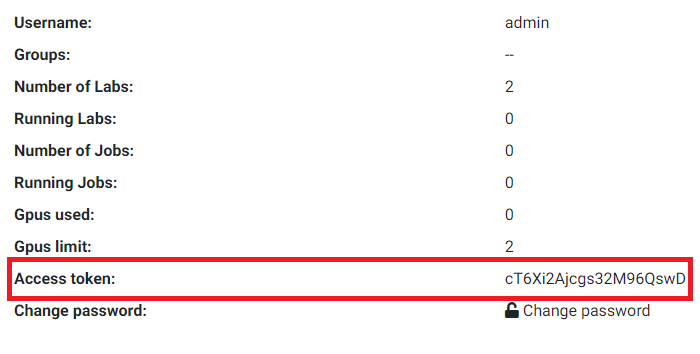

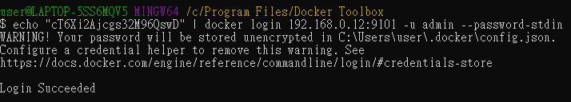

Pull image from the project
----------------------------

Your access_token can only pull images if you are project member.

Pull the image we just uploaded. 

.. code-block:: bash

    docker pull 192.168.0.12:9101/91388126/test_dockerfile:latest

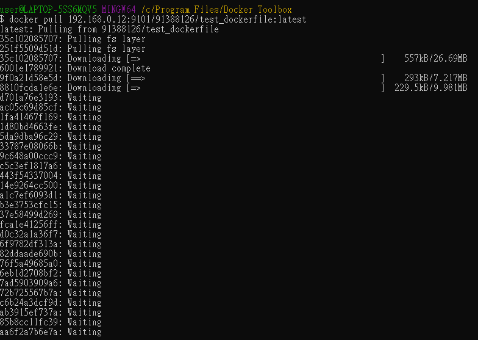

You can also pull the public image, hello-world.

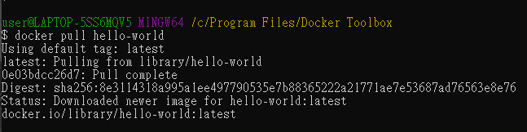

Push image to the project
--------------------------

Tag image name under the project id namespace if you want to push the image to the project.

.. code-block:: bash

    docker tag hello-world:latest 192.168.0.12:9101/91388126/hello-world:latest

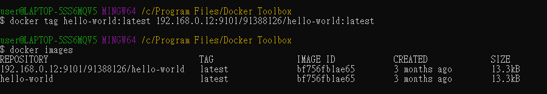

Then, push the image.

.. code-block:: bash

    docker push 192.168.0.12:9101/91388126/hello-world

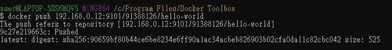

You will see the image shown in the project image list.

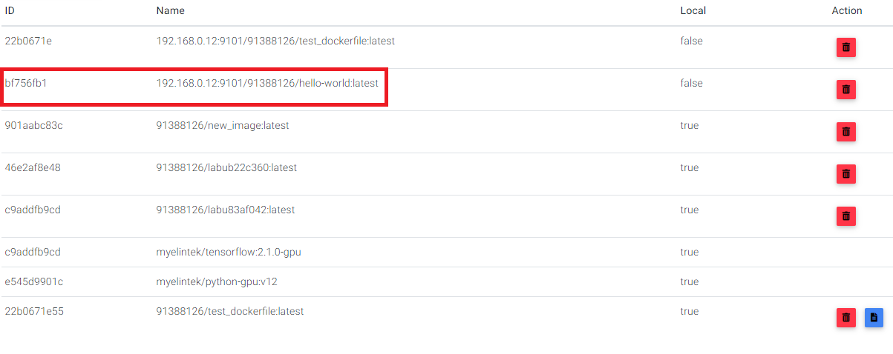

