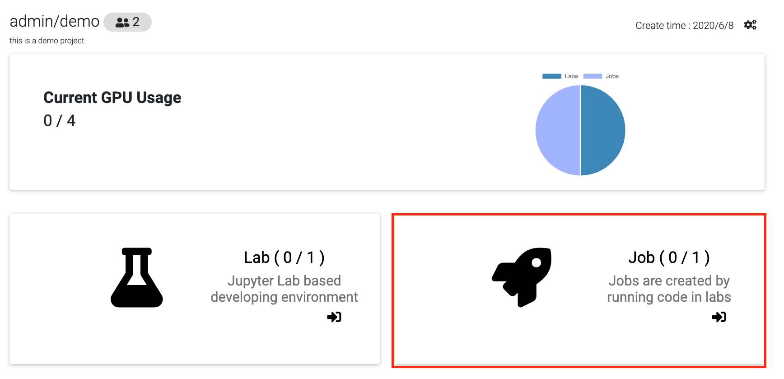
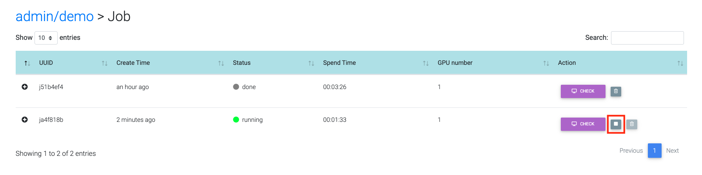
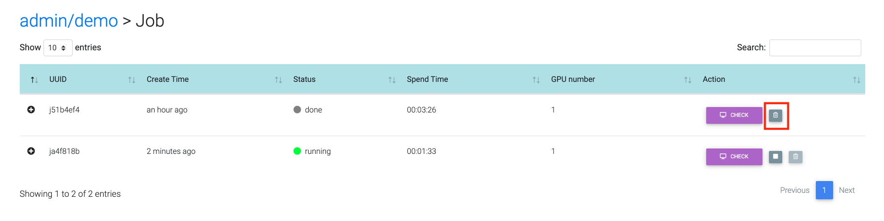
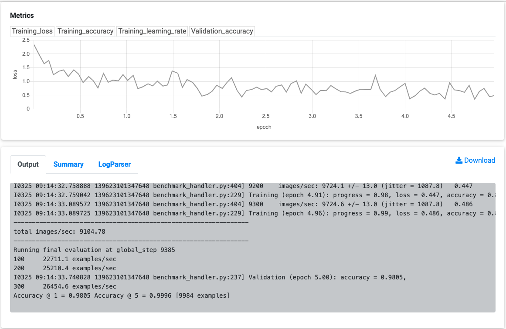
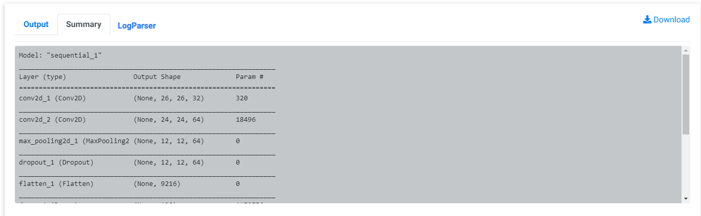

.. _job:

***
Job
***

Create job
==========

Jobs are created by running code in labs or running templates.

Browse jobs
===========

Go into project page.
Click on "Job".

List of jobs belonging to project will show up.
Click on job's id or screen icon next to it to see details.

Stop job
========

Click on stop icon next to running job id.

Delete job
==========

First stop job, if it is running. Click on tresh icon next to job id.

Metrics of job
==============

First You should define your program output to fit below format:
  [Group] [x-axis]=[x-value] [y1-axis]=[y1-value] [y2-axis]=[y2-value]...[yn-axis]=[y2-value]

"Occur Only Onece"

- [Group] can be those words: Validation, Train, Test

- [x-axis]: Step, Iter, Epoch

"Occur Many"

- [yn-axis]: Any words you like, such as loss, mvp, avg, acc....

Every [y-axis] will output a metrics, and prefixed by [group]. For example, 'Train_loss'.

There are 2 output examples:

1. Train step=10 loss=0.818 acc=0.95

   => Produce two metrics: Train_loss(x:step, y:loss), Train_acc(x:step, y:acc)

2. Validation epoch=1.66 loss=0.818 acc_top5=0.95 acc_top1=0.8

   => Produce three metrics: Validation_loss(x:epoch, y:loss), Validation_acc_top5(x:epoch, y:acc_top5), Validation_acc_top1(x:epoch, y:acc_top1)

A example of metrics and output:

Model summary
=============

Job will parse model summary from output log. It will show on summary tab. For now, it can support "Keras", "Pytorch", "tensorflow2.0" platform.

