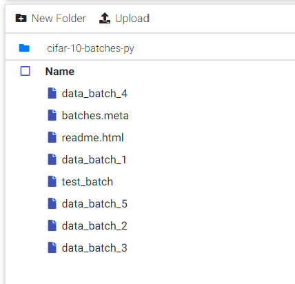

****************************
Train Local Dataset Tutorial
****************************

Environment
===========

Create a LAB
++++++++++++

Click LAB button in your project and click NEW LAB in Lab home page

Choose the python-gpu image and specify GPU number. 

If GPU number is 0, it will only for cpu.

Upload Dataset
++++++++++++++

We use cifar10 as a example, the archive file download here. :download:`cifar10<http://www.cs.toronto.edu/~kriz/cifar.html>` 

We download the CIFAR-10 python version.

Go to Dataset Panel, click NEW DATASET button.

.. image:: ../_static/dataset/new_dataset.png

Input the dataset name, it's cifar10 here.

In the cifar10 dataset window, click the Upload button in order to upload the cifar10 archive file that we just download.

Choose the archive file.

It's uploading now.

After finish upload, choose the archive file and click the Extract button.

Click into the extracted cifar-10-batches-py folder, now we can scan the content.

Attach Cifar10 Dataset
++++++++++++++++++

Attach the cifar10 dataset folder.

Click the dataset icon at left of the page, and select cifar10 dataset. 
The LAB need to restart for dataset load.

Write a Notebook file
=====================

Start a notebook
++++++++++++++++

Click the '+' button if you can't find the launcher tab.

Choose the Python3 Notebook

We might rename your notebook file to you want.

We can input your code in the cell, then click run button to excute code in the cell. 

Extract train and test images form pickle file
++++++++++++++++++++++++++++++++++++++++++++++

Paste the code in a cell, and execute. This code will store images under /mlsteam/input/train and /mlsteam/input/test folders. 

.. code-block:: python

    from matplotlib.pyplot import imsave
    import numpy as np
    import os
    from pathlib import Path

    base_folder = '/mlsteam/input/'
    train_folder = os.path.join(base_folder, 'train')
    test_folder = os.path.join(base_folder, 'test')

    Path(train_folder).mkdir(parents=True, exist_ok=True)
    Path(test_folder).mkdir(parents=True, exist_ok=True)

    def unpickle(file):
        import pickle
        with open(file, 'rb') as fo:
            dict = pickle.load(fo, encoding='latin1')
        return dict

    for i in range(1, 6):
        filename = os.path.join(base_folder, 'cifar-10-batches-py/data_batch_{}'.format(i))
        print(filename)
        content = unpickle(filename)
        for j in range(0, 10000):
            data = content['data'][j]
            label = content['labels'][j]
            img = np.reshape(data, (3, 32, 32))
            img = img.transpose(1,2,0)
            
            label_folder = os.path.join(train_folder, str(label))
            Path(label_folder).mkdir(parents=True, exist_ok=True)
            img_name = os.path.join(label_folder, str(j) + '.jpg')
            imsave(img_name, img)
        print('ok')

    filename = os.path.join(base_folder, 'cifar-10-batches-py/test_batch')
    print(filename)
    content = unpickle(filename)
    for i in range(0, 10000):
        data = content['data'][i]
        label = content['labels'][i]
        img = np.reshape(data, (3, 32, 32))
        img = img.transpose(1,2,0)
        
        label_folder = os.path.join(test_folder, str(label))
        Path(label_folder).mkdir(parents=True, exist_ok=True)
        img_name = os.path.join(label_folder, str(i) + '.jpg')
        imsave(img_name, img)
    print('ok')

Cifar10 is dataset contains a lot of images with a sigle label class.
The directory structure might like this:

.. code-block:: plant

    input -|
           |- test
           |- train-|
                    |-0
                    |-1
                    |-2
                    |-3
                    |-4
                    |-5
                    |-6
                    |-7
                    |-8
                    |-9

It is obvious that the folder name 1,2,..9 is the label,
it contain images with the label.

Make dataframe pair (image and label)
++++++++++++++++++++++++++++++++++++++

Now we start get the images path, and produce the pair list of (image_path, label)

.. code-block:: python

    import os
    data_pair_list = []
    for entry in os.scandir('/mlsteam/input/train'):
        if entry.is_dir():
            # folder name = label
            label = entry.name
            for file in os.scandir(entry.path):
                # images in folder
                img = file.path
                data_pair_list.append([img, label])

We can show the list now:

.. code-block:: python

    show_ahead_number = 20
    for path, label in data_pair_list[:show_ahead_number]:
        print(path, label)

We might shuffle the data, and divide the data into 2 part: train and valid. 

.. code-block:: python

    import random

    random.shuffle(data_pair_list)

    total_num = len(data_pair_list)

    train_ratio = 70
    train_num = total_num * train_ratio // 100
    train_pair_list = data_pair_list[:train_num]

    valid_num = total_num - train_num
    valid_pair_list = data_pair_list[-valid_num:]

Since the ImageDataGenerator of keras receive Pandas DataFrame, 
we should transfer it.

.. code-block:: python

    import pandas as pd
    train_img, train_label = zip(*train_pair_list)
    train_df = pd.DataFrame({"x":train_img, "y":train_label})

Use ImageDataGenerator for model input
++++++++++++++++++++++++++++++++++++++

We can create image generator and add augmentation here

.. code-block:: python

    from keras.preprocessing.image import ImageDataGenerator
    train_datagen = ImageDataGenerator(
        samplewise_center=True,
        samplewise_std_normalization=True,
        rotation_range=20,
        width_shift_range=0.2,
        height_shift_range=0.2,
        horizontal_flip=True,
        rescale=1./255
    )

Finally pass datafrme into generator function flow_from_dataframe, 
the function can read image from the path of list automaticlly.  

.. code-block:: python

    train_generator = train_datagen.flow_from_dataframe(
                            dataframe=train_df,
                            x_col="x", 
                            y_col="y", 
                            class_mode="categorical", 
                            target_size=(32, 32), 
                            batch_size=32)

And do the same thing for valid data, 
it's worth to mention that we shouldn't 
add any augmentation on valid data, 
except rescale images.

.. code-block:: python

    valid_img, valid_label = zip(*valid_pair_list)
    valid_df = pd.DataFrame({"x":valid_img, "y":valid_label})

    valid_datagen = ImageDataGenerator(
        rescale=1./255
    )
    valid_generator = train_datagen.flow_from_dataframe(
                            dataframe=valid_df,
                            x_col="x", 
                            y_col="y", 
                            class_mode="categorical", 
                            target_size=(32, 32), 
                            batch_size=32)

Model Training
++++++++++++++

Create a simple model, and traing

.. code-block:: python

    from keras import models, layers, optimizers

    model = models.Sequential([
        layers.Conv2D(32,(3,3),activation='relu',input_shape=(32,32,3)),
        layers.MaxPooling2D((2,2)),
        layers.Conv2D(64,(3,3),activation='relu'),
        layers.MaxPooling2D((2,2)),
        layers.Dropout(0.5),
        layers.Conv2D(64,(3,3),activation='relu'),
        layers.Flatten(),
        layers.Dense(64,activation='relu'),
        layers.Dense(10,activation='softmax')
    ])

    opt = optimizers.Adam(lr=0.01)
    model.compile(optimizer='Adam' , loss='categorical_crossentropy' , metrics=['accuracy'])

Start Training 10 epochs, and validation it.

.. code-block:: python

    model.fit_generator(train_generator, epochs=10)

    loss, acc = model.evaluate_generator(valid_generator, verbose=1)

You can save the model parameters as a HDF5 format file.

.. code-block:: python

    model.save('my_model.h5')

