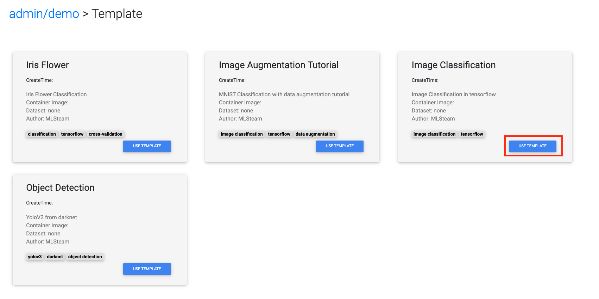

.. _object_detection:

Object Detection
================

This part will show how to train object detection model from template.

Quick start
-----------

On the top bar click "Template".

Then click "Use Template" on the object detection card. This will create an object detection project named "objectdetection" with Pascal dataset already attached to it.

.. image:: ../_static/template/create_template1.png

In the lab page, click "Commit and run". This will start training job from the template code and redirect to the jobs list page.

Click on the job id or screen icon to view training progress.

.. image:: ../_static/template/view_job1.png

Job page displays 

* Loss value graph and graphs for three regions each with 50% and 75% recall value.
* Log output
* Configuration file (mlsteam.yml)
* Used docker image name, gpus, status, status button (top panel)

Inference example
-----------------

Back to the Lab page, open the file 'try_detection.ipynb' in jupyterlab. Click run multiple times to examine a pretrained yolov3-tiny.weights file.

.. image:: ../_static/template/run_lab.jpg

If you want to follow the YOLO webside (https://pjreddie.com/darknet/yolo/) to train the yolo model step by step.

You can launch a new lab and execute the terminal then follow the instructions provided in the YOLO webside.

Custom dataset
-----------------

1.Prepare your data set

Before starting to train, you must prepare your data for object detection.
To prepare your data, you can use VoTT (Microsoft's Visual Object Tagging Tool) to and annotate images.
https://github.com/microsoft/VoTT

2.Prepare YOLOv3 configuration files

YOLOv3 needs certain specific files to know how and what to train.
You must create these three files(.data, .names, and .cfg)

3.Upload your dataset. (Please see the page: :ref:`create_dataset`).
:ref:`attach_dataset_lab`

4.Check the file voc.data (/lab/cfg/voc.data)

.. code-block:: bash

    classes = 20 #number of class in your data set
    train  = /mlsteam/input/pascalvoc/train.txt #relpace to your train file path
    valid  = /mlsteam/input/pascalvoc/2007_test.txt #replace to your test file path
    names = data/voc.names #class names file
    backup = /mlsteam/input/backup

.. tip::

  backup: backup the weights files to your dataset path.

  The public dataset(pascalvoc) is read only.

  Please make sure you have already create/clone your own dataset.

  Please see the page :ref:`create_dataset` for creating or cloning the dataset.

5.Check the file data/voc.names

Every new category should be on a new line.

.. code-block:: bash

    aeroplane
    bicycle
    bird
    boat
    bottle
    bus
    car
    cat
    chair
    cow
    diningtable
    dog
    horse
    motorbike
    person
    pottedplant
    sheep
    sofa
    train
    tvmonitor

