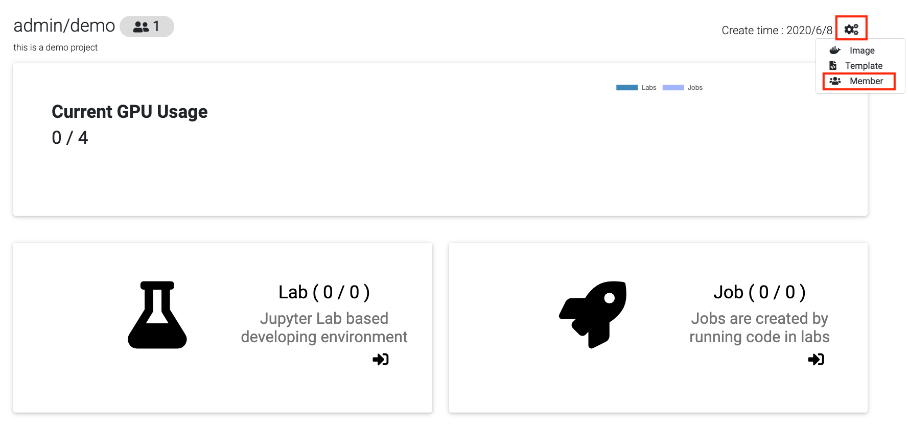
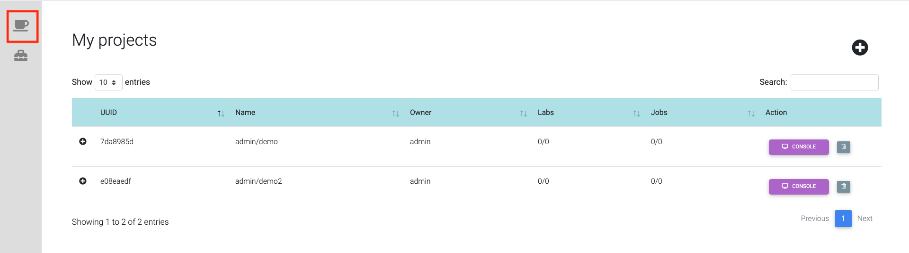

.. _project:

*******
Project
*******

.. _create_project :

Create project
==============

Click "Project" or "new project" button. 

Click on the upper right button to create a new project.

Input project name and any related notes, then click "Create".

The last created project becomes the default project.

Browse projects
===============

Click the button "console" to see your project status and the dashboard.

View project
============

Open list of projects. 

Click on project's name to view its content.

Add member
==========

On the projects page click the setting button at the upper right of screen.

Click "Member".

Type members name. Select role. Click "Add".

If you haven't create any user, please create a user in the first.
(Please see the page: :ref:`admin`)

Modify user name and click "save" button.

"Delete" button will remove member from project.

Delete project
==============

Click the button with the default project name to open the list of projects. 

Click trash icon on the side of project that needs to be deleted.

Confirm.

