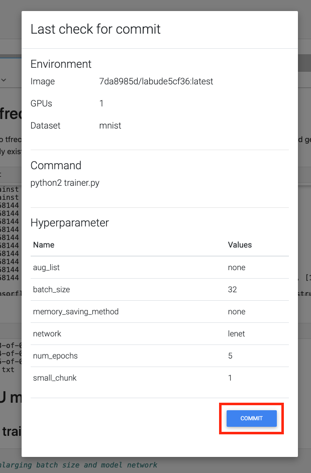

************
Quick start
************

This part will show how to train image classification model from template.

On project page click "Template".

.. image:: ../_static/template/create_template1.png

Then click "Use Template" on the classification card. This will create an image classification project named "Image Classification" with Mnist dataset already attached to it.

.. image:: ../_static/template/create_template2.png

Click "Commit job". This will start training job from the template code and redirect to the jobs list page.

.. image:: ../_static/template/run_template.png

Click on the job id or screen icon to view training progress.

Job page displays 

* Loss value graph
* Log output
* Configuration file (mlsteam.yml)
* Used docker image name, gpus, status, status button (top panel)

.. image:: ../_static/template/view_job2.png
